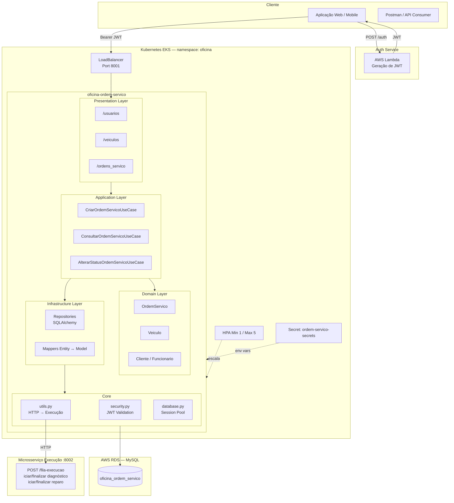
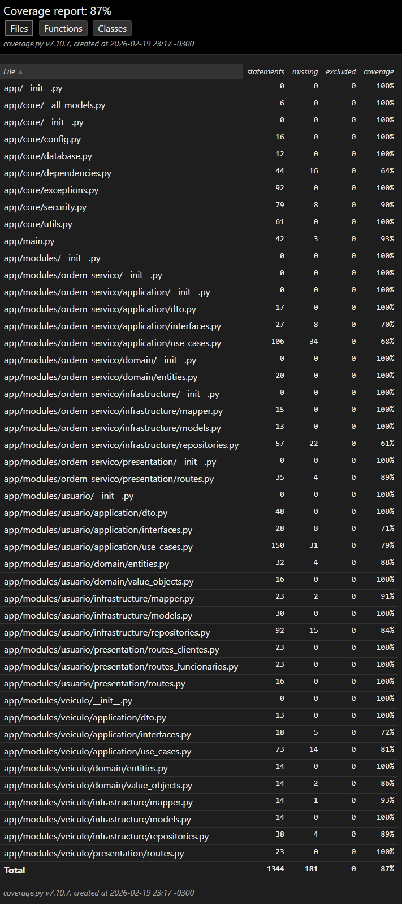

# Oficina Mecânica — Ordem de Serviço

Microsserviço responsável pelo ciclo de vida das Ordens de Serviço, cadastro e autenticação de usuários e gestão de veículos.

---

## Arquitetura



> Diagrama completo: [architecture.mmd](architecture.mmd)

---

## 1) Rotas principais (Swagger/OpenAPI)

Swagger UI disponível em `/docs`. Porta padrão: **8001**.

### Autenticação
| Método | Rota | Descrição |
|--------|------|-----------|
| `POST` | `/usuarios/login` | Autenticação — retorna JWT |

### Clientes
| Método | Rota | Descrição |
|--------|------|-----------|
| `POST` | `/usuarios/clientes/cadastrar` | Cadastrar cliente (PF/PJ) |
| `GET` | `/usuarios/clientes/{cliente_id}` | Buscar cliente |
| `PUT` | `/usuarios/clientes/{cliente_id}` | Atualizar cliente |
| `DELETE` | `/usuarios/clientes/{cliente_id}` | Remover cliente |

### Funcionários
| Método | Rota | Descrição |
|--------|------|-----------|
| `POST` | `/usuarios/funcionarios/cadastrar` | Cadastrar funcionário (Admin/Mecânico) |
| `GET` | `/usuarios/funcionarios/{funcionario_id}` | Buscar funcionário |
| `PUT` | `/usuarios/funcionarios/{funcionario_id}` | Atualizar funcionário |
| `DELETE` | `/usuarios/funcionarios/{funcionario_id}` | Remover funcionário |

### Veículos
| Método | Rota | Descrição |
|--------|------|-----------|
| `POST` | `/veiculos` | Cadastrar veículo |
| `GET` | `/veiculos/{veiculo_id}` | Buscar veículo |
| `PUT` | `/veiculos/{veiculo_id}` | Atualizar veículo |
| `DELETE` | `/veiculos/{veiculo_id}` | Remover veículo |

### Ordens de Serviço
| Método | Rota | Descrição |
|--------|------|-----------|
| `GET` | `/ordens_servico` | Listar todas as OS |
| `POST` | `/veiculos/{veiculo_id}/ordens_servico` | Criar OS para um veículo |
| `GET` | `/veiculos/{veiculo_id}/ordens_servico` | Listar OS do veículo |
| `GET` | `/veiculos/{veiculo_id}/ordens_servico/{ordem_servico_id}` | Consultar OS |
| `GET` | `/veiculos/{veiculo_id}/ordens_servico/{ordem_servico_id}/status` | Consultar status da OS |
| `PATCH` | `/veiculos/{veiculo_id}/ordens_servico/{ordem_servico_id}/status` | Atualizar status da OS |
| `DELETE` | `/veiculos/{veiculo_id}/ordens_servico/{ordem_servico_id}` | Remover OS |

### Health Check
| Método | Rota |
|--------|------|
| `GET` | `/health` |

---

## 2) Integrações (com Orçamento e Execução)

Este serviço chama o microsserviço de **Execução** (`oficina-execucao`) via HTTP para gerenciar a fila de execução conforme o ciclo da OS:

| Ação na OS | Chamada ao Execução |
|---|---|
| OS criada | `POST /fila-execucao` |
| Diagnóstico iniciado | `POST /fila-execucao/{id}/iniciar-diagnostico` |
| Diagnóstico finalizado | `POST /fila-execucao/{id}/finalizar-diagnostico` |
| Reparo iniciado | `POST /fila-execucao/{id}/iniciar-reparo` |
| Reparo finalizado | `POST /fila-execucao/{id}/finalizar-reparo` |

A URL base é configurada via variável de ambiente `URL_API_EXECUCAO`. As chamadas HTTP ficam centralizadas em `app/core/utils.py`. Em caso de indisponibilidade do serviço de execução, o erro é tratado silenciosamente (retorna `None`) para não bloquear o fluxo da OS.

A integração com o microsserviço de **Orçamento** ocorre no contexto de atualização de status da OS após aprovação/rejeição de orçamento.

---

## 3) Estratégia de dados (DB próprio)

- Banco exclusivo: **MySQL** (`oficina_ordem_servico`)
- ORM: **SQLAlchemy** com driver `mysql+pymysql`
- Cada microsserviço possui banco isolado — sem compartilhamento de schema
- Script de inicialização: `scripts/create_db_ordem_servico.sql`

Variáveis de ambiente para conexão:

| Variável | Exemplo |
|---|---|
| `USER_DB` | `fiapsoatdbuser` |
| `PASSWORD_DB` | `*****` |
| `HOST_DB` | `fiap-challenge-db...rds.amazonaws.com` |
| `PORT_DB` | `3306` |
| `DATABASE` | `oficina_ordem_servico` |

---

## 4) Execução local e deploy no Kubernetes

### Execução local

**Com Docker Compose:**
```bash
docker-compose up -d
```
A API sobe na porta `8000` (compose) e o MySQL na `3310`.

**Sem Docker (venv):**
```bash
pip install -r requirements.txt

export USER_DB=root
export PASSWORD_DB=root
export HOST_DB=127.0.0.1
export PORT_DB=3306
export DATABASE=oficina_ordem_servico
export SECRET_KEY=fakerandomsecretkey
export ALGORITHM=HS256
export JWT_ISSUER=oficina-auth
export JWT_AUDIENCE=oficina-api
export URL_API_EXECUCAO=http://localhost:8002

uvicorn app.main:app --reload --port 8001
```

### Deploy no Kubernetes (AWS EKS)

```bash
# Criar namespace
kubectl apply -f k8s/namespace.yaml

# Criar secret com credenciais
kubectl apply -f k8s/secret.yaml -n oficina

# Deployment, Service e HPA
kubectl apply -f k8s/deployment.yaml -n oficina
kubectl apply -f k8s/service.yaml -n oficina
kubectl apply -f k8s/hpa.yaml -n oficina
```

O serviço é exposto via **LoadBalancer** (AWS ELB) na porta `8001`. Para obter o DNS público:
```bash
kubectl get svc oficina-ordem-servico-api-service -n oficina
```

---

## 5) Testes + cobertura

Executar suíte completa com cobertura mínima de **80%**:

```bash
pytest --cov=app --cov-report=xml --cov-report=html --cov-fail-under=80 --maxfail=1 --disable-warnings -q
```

Relatórios gerados em:
- `coverage.xml` — integração com CI/CD
- `htmlcov/index.html` — relatório visual

